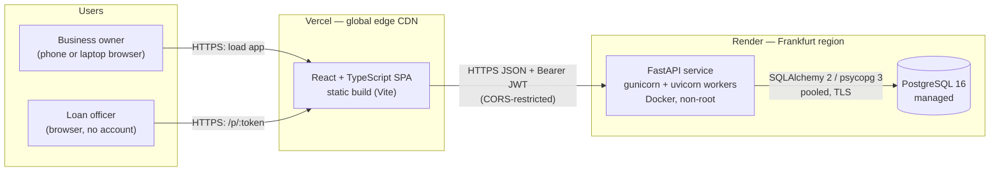
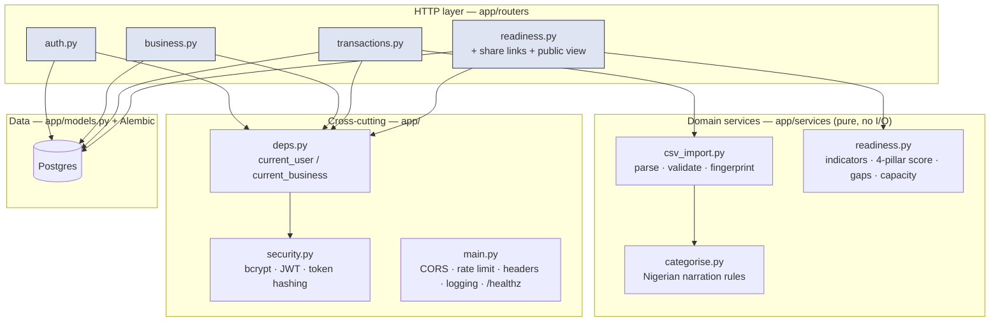
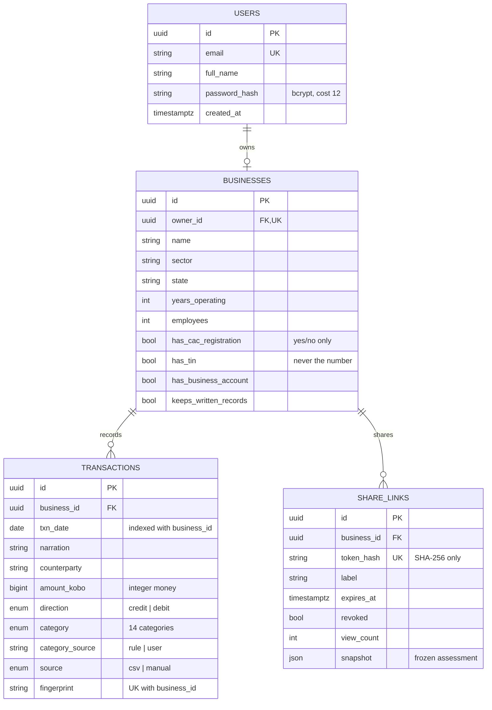
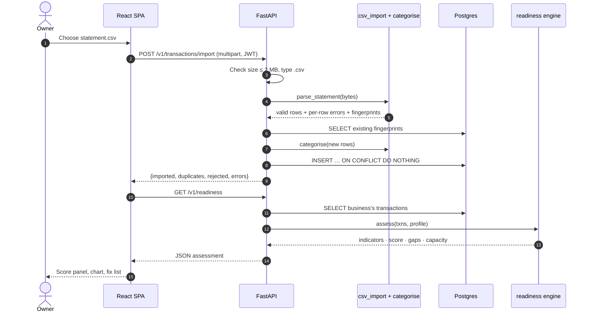
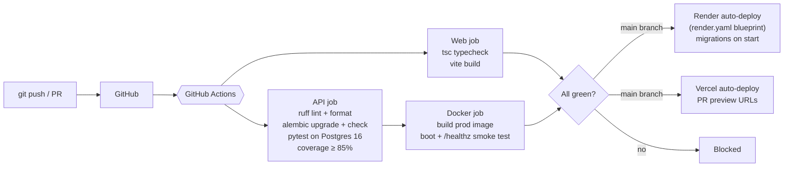

# KudiReady — Architecture

Rendered PNGs of each diagram are in [`docs/diagrams/`](./diagrams).

## 1. System architecture

## 2. Backend module structure

## 3. Data model

## 4. Statement import and scoring flow

## 5. Delivery pipeline

